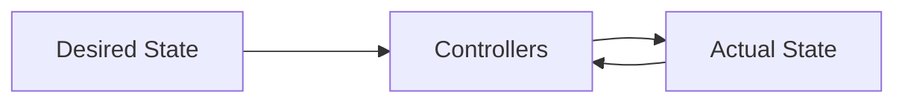
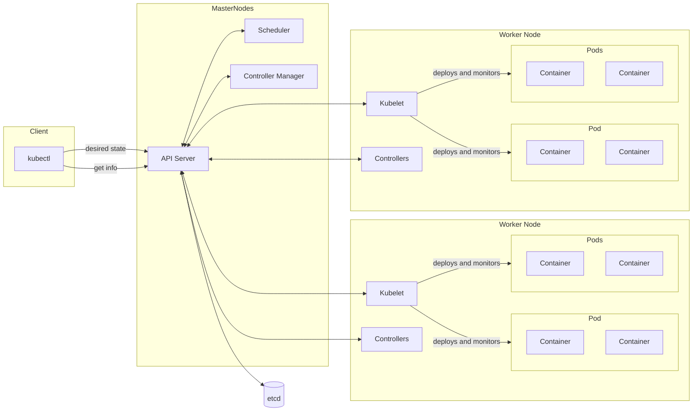
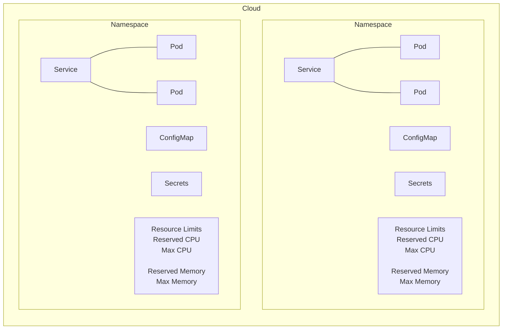

# k8s-showcase
Simple showcase for K8s

## About kubernetes

### Desired state / Reconciliation

```mermaid
flowchart LR

DesiredState["Desired State"]

ActualState["Actual State"]

Controller["Controllers"]

ActualState --> Controller
DesiredState ---> Controller
Controller --> ActualState
```

### Physical view

```mermaid
flowchart LR

subgraph Client
    CLI[kubectl]
end

subgraph MasterNodes
    API[API Server]
    Scheduler[Scheduler]
    ControllerManager[Controller Manager]
end

etcd[(etcd)]

subgraph WorkerNode1[Worker Node]
    Kubelet1[Kubelet]
    subgraph Pods1_1[Pod]
        Container1_1_1[Container]
        Container1_1_2[Container]
    end

    subgraph Pods1_2[Pods]
        Container1_2_1[Container]
        Container1_2_2[Container]
    end
    Controllers1[Controllers]
end

subgraph WorkerNode2[Worker Node]
    Kubelet2[Kubelet]
    subgraph Pods2_1[Pod]
        Container2_1_1[Container]
        Container2_1_2[Container]
    end

    subgraph Pods2_2[Pods]
        Container2_2_1[Container]
        Container2_2_2[Container]
    end
    
    Controllers2[Controllers]
end

CLI -- "desired state" --> API
CLI -- "get info" --> API

API --> etcd

API <--> Scheduler
API <--> ControllerManager
API <---> Kubelet1
API <---> Controllers1
API <---> Kubelet2
API <---> Controllers2

Kubelet1 -- "deploys and monitors" --> Pods1_1
Kubelet1 -- "deploys and monitors" --> Pods1_2
Kubelet2 -- "deploys and monitors" --> Pods2_1
Kubelet2 -- "deploys and monitors" --> Pods2_2
```

## Logical view - Worker nodes

```mermaid
flowchart LR

subgraph Cloud

    subgraph ns1[Namespace]
        Pod1_1[Pod]
        Pod1_2[Pod]
        Service1[Service]
        Configmap1[ConfigMap]
        Secrets1[Secrets]


        Resources1["Resource Limits
        Reserved CPU
        Max CPU
        
        Reserved Memory
        Max Memory"]


        Service1 --- Pod1_2
        Service1 --- Pod1_1

    end


    subgraph ns2[Namespace]
        Pod2_1[Pod]
        Pod2_2[Pod]
        Service2[Service]
        Configmap2[ConfigMap]
        Secrets2[Secrets]

        Resources2["Resource Limits
        Reserved CPU
        Max CPU
        
        Reserved Memory
        Max Memory"]

        Service2 --- Pod2_2
        Service2 --- Pod2_1


    end


end
```
