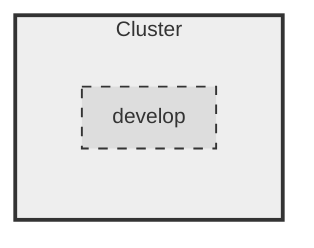
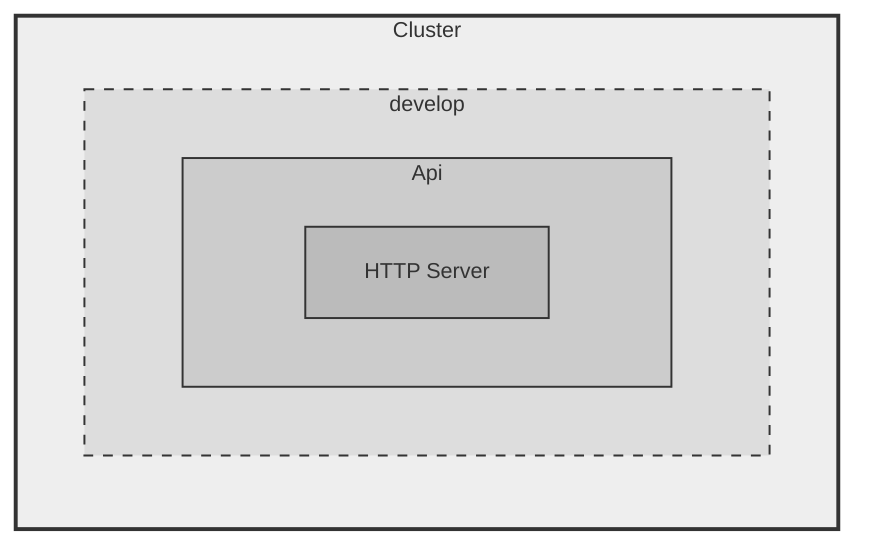
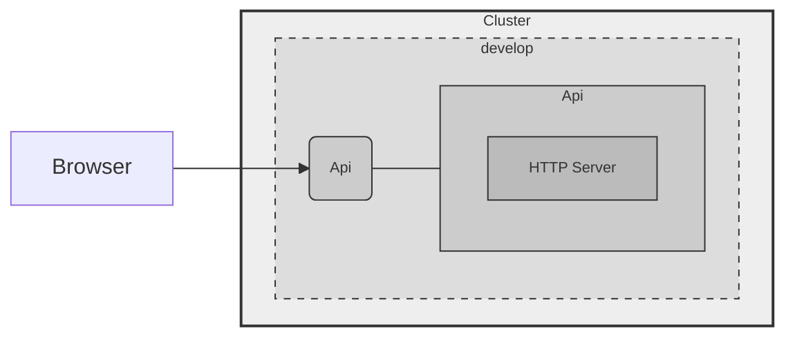
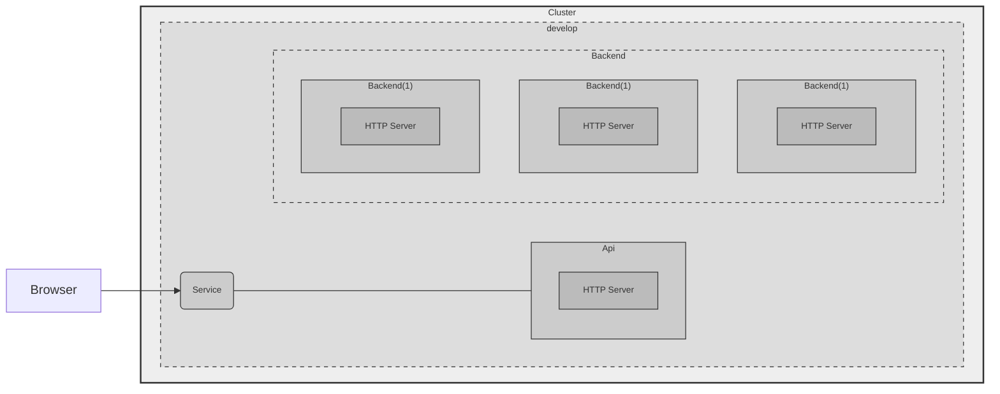
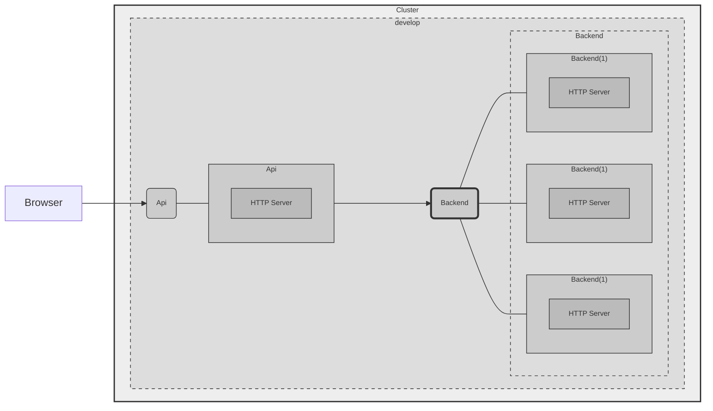

# Script for the demo

## 1 - Create a Namespace

### Goal



### Resource files


[namespace.yaml](.k8s/develop/namespace.yaml)

### Commands

```shell
kubectl get ns

kubectl apply -f .k8s/develop/namespace.yaml 

kubectl get ns

kubectl get pods --namespace develop
```

## 2 - Create the Api via Pod

### Goal



### Resources

[api.yaml](.k8s/develop/api.yaml)

### Commands

```shell
kubectl apply -f .k8s/develop/api.yaml 

kubectl get pods -n develop

kubectl describe po api -n develop
```

## Expose Pod 1 via Service 1

### Goal




### Resources

[api-svc.yaml](.k8s/develop/api-svc.yaml)

### Commands

```shell
kubectl apply -f .k8s/develop/api-svc.yaml

kubectl get all -n develop
```

Open: http://localhost:30001


## Add backend via Deployment

### Goal




Show [backend.yaml](.k8s/develop/backend.yaml)

```shell

kubectl apply -f .k8s/develop/backend.yaml

kubectl get all -n develop
```

### 5 - Connect Api to Backend


### Goal



### Resources

[backend service](.k8s/develop/backend-svc.yaml)

```shell

kubectl apply -f .k8s/develop/backend-svc.yaml

kubectl get all -n develop
```

Open: http://localhost:30001
