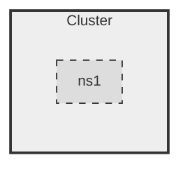
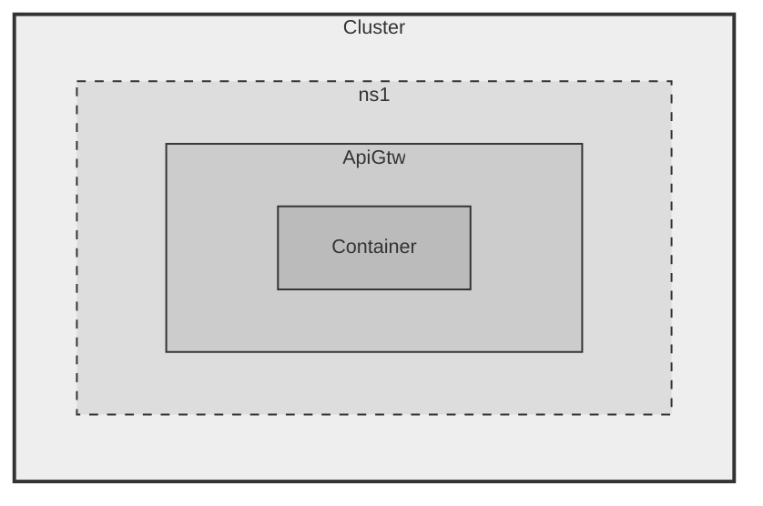
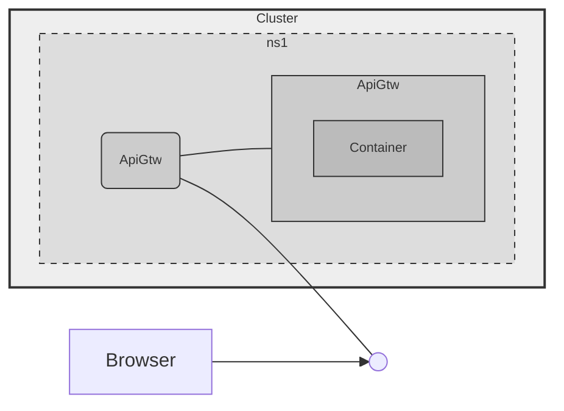
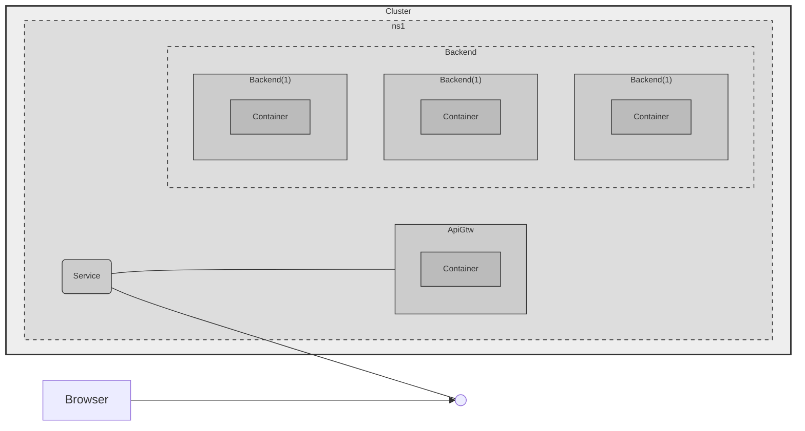
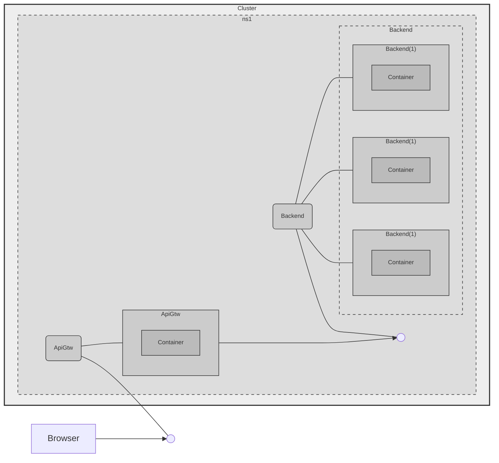

# Script for the demo

## 1 - Create a Namespace

### Goal



### Resource files


[namespace.yaml](.k8s/1_namespace1.yaml)

### Commands

```shell
kubectl get ns

kubectl apply -f .k8s/1_namespace1.yaml 

kubectl get ns

kubectl get pods --namespace ns1
```

## 2 - Create the ApiGtw via Pod

### Goal



### Resources

[ApiGtw.yaml](.k8s/2_api-gtw.yaml)

### Commands

```shell
kubectl apply -f .k8s/api-gtw.yaml 

kubectl get pods -n ns1

kubectl describe po api-gtw -n ns1
```

## Expose Pod 1 via Service 1

### Goal




### Resources

[api-gtw-svc.yaml](.k8s/3-api-gtw-svc.yaml)

### Commands

```shell
kubectl apply -f .k8s/3_api-gtw-svc.yaml

kubectl get all -n ns1
```

Open: http://localhost:30001


## Add backend via Deployment

### Goal




Show [backend-deployment.yaml](.k8s/4_backend-deployment.yaml)

```shell

kubectl apply -f .k8s/deployment1.yaml

kubectl get all -ns ns1
```

### 5 - Connect ApiGtw to Backend


### Goal



### Resources

[backend service](.k8s/5_backend-svc.yaml)

```shell

kubectl apply -f .k8s/5_backend-svc.yaml

kubectl get all -ns ns1
```

Open: http://localhost:30001
